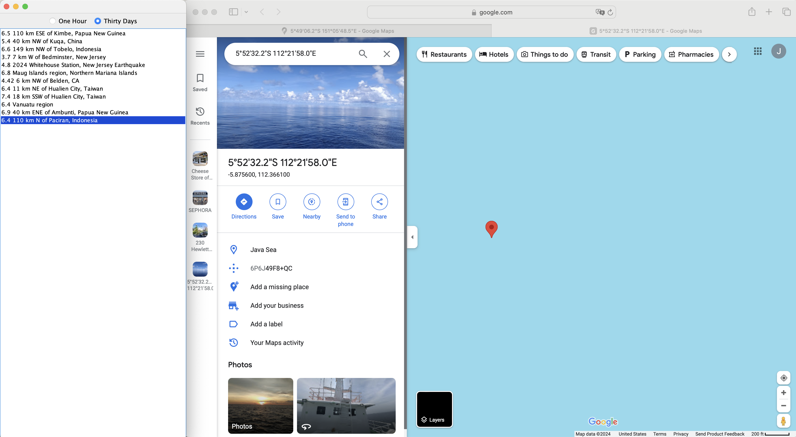

# Earthquake Viewer
The Earthquake Viewer  is a Java GUI application designed to display information about recent earthquakes. It fetches earthquake data from the USGS (United States Geological Survey) API and presents it to the user in a user-friendly interface.

### Documentation 
[Radio Button]( https://docs.oracle.com/javase/tutorial/uiswing/components/button.html)
[ListSelectionListener](https://docs.oracle.com/javase%2Ftutorial%2F/uiswing/events/listselectionlistener.html)
[Open Browser](https://stackoverflow.com/a/5226244)
[Google Map](https://stackoverflow.com/a/52943975)

### Technologies 
[RxJava](https://github.com/ReactiveX/RxJava)
[USGS API](https://earthquake.usgs.gov/)

